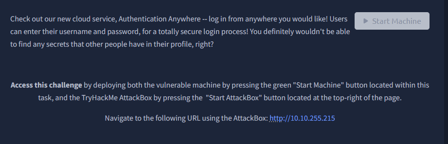
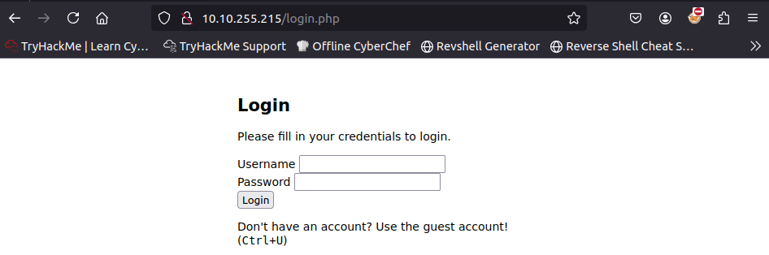
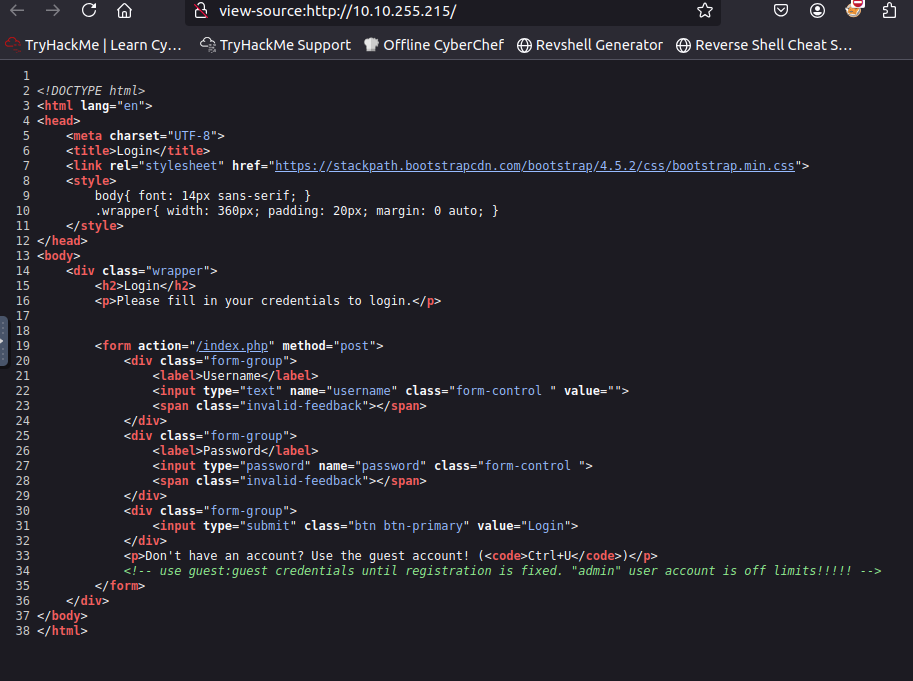
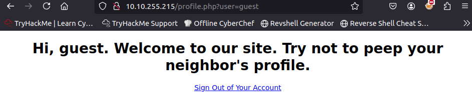
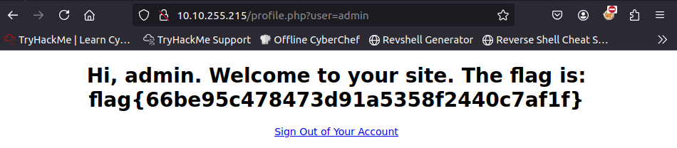

So an easy one.

https://tryhackme.com/room/neighbour

so we’re accessing the url and we get this website (very pretty btw)

since i don’t have an account i’ll naively press ctrl+u and it opens the
source code of the page

this source code gives us a hint on how we can access the guest account
by having the login and the password as followed :

Login : guest

Password : guest

and we get our profile page.

and we can easily move laterally and get the admin user.

and that’s it. there’s the flag right here.
